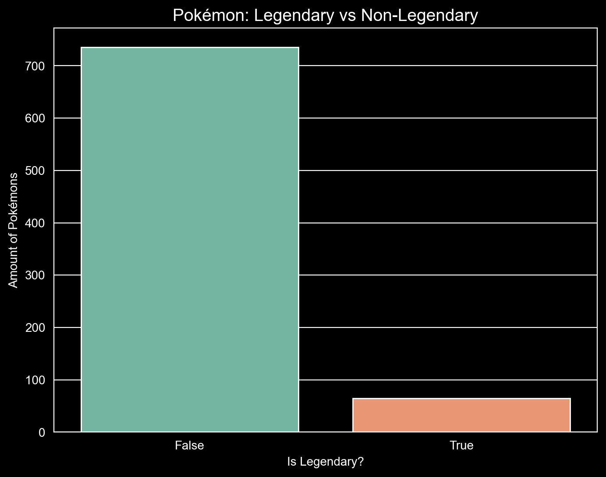
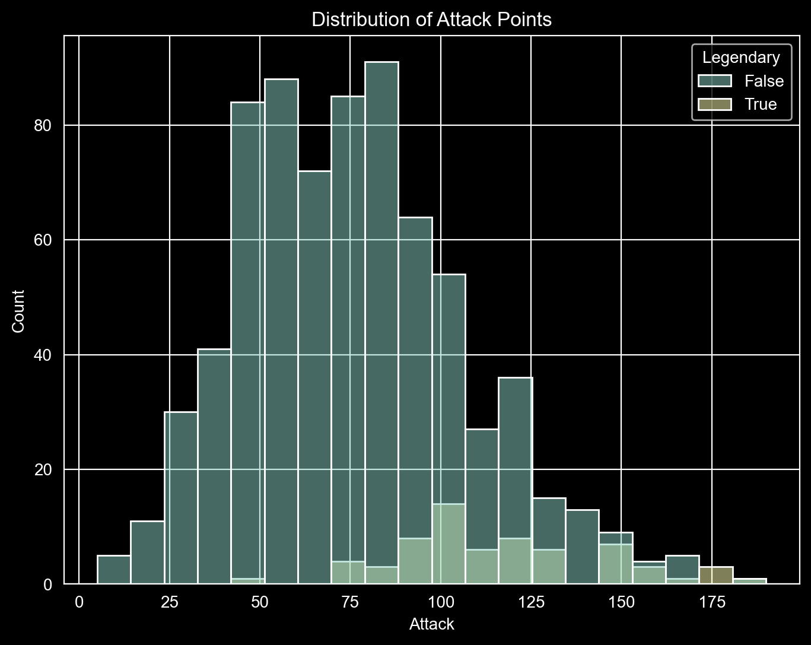

## Task 1
### Kuba

```
import pandas as pd

europe_2007 = df_gapminder[
    (df_gapminder['continent'] == 'Europe') &
    (df_gapminder['year'] == 2007)
]

print(europe_2007['life_exp'].mean())
```


## Task 2
### Kuba

```
print(df_gapminder['continent'].mean())
```
Comment: TypeError: Cannot perform reduction 'mean' with string dtype


## Task 3
### Kuba

```
import numpy as np

numbers = np.array([1, 2, 3, 4])

average = np.mean(numbers)
deviations = average - numbers
total = np.sum(deviations)

print(average)
print(deviations)
print(total)
```


## Task 4
### Mateusz

```
df_gapminder['continent'].median()
```
Comment: Its not possible because the continent column is a string


## Task 5
### Mateusz

```
import pandas as pd
import numpy as np
import matplotlib.pyplot as plt
import seaborn as sns

mydata = [3, 7, 8, 5, 12, 14, 21, 13, 18]


fig, ax = plt.subplots(figsize=(8, 6))

sns.violinplot(data=mydata, ax=ax, color='lightgreen', inner=None)

minimum = np.min(mydata)
q1 = np.percentile(mydata, 25)
median = np.median(mydata)
q3 = np.percentile(mydata, 75)
maximum = np.max(mydata)
mean = np.mean(mydata)

ax.scatter(0, minimum, color='red', label='Min', zorder=5)
ax.scatter(0, q1, color='orange', label='Q1 (25th percentile)', zorder=5)
ax.scatter(0, median, color='green', label='Median (50th percentile)', zorder=5)
ax.scatter(0, q3, color='purple', label='Q3 (75th percentile)', zorder=5)
ax.scatter(0, maximum, color='brown', label='Max', zorder=5)
ax.scatter(0, mean, color='black', marker='D', s=60, label='Mean', zorder=5)

for value, name, color in zip(
    [minimum, q1, median, mean, q3, maximum],
    ['Min', 'Q1', 'Median', 'Mean', 'Q3', 'Max'],
    ['red', 'orange', 'green', 'black', 'purple', 'brown']
):
    ax.text(0.1, value, f'{name}: {value:.2f}', verticalalignment='center', color=color)

ax.set_title('Violin Plot of mydata with All Measures Marked')
ax.legend(bbox_to_anchor=(1.05, 1), loc='upper left')
plt.show()
```
Comment: The Median is 12, meaning exactly half of the dataset's values are smaller than 12, and half are larger. The lower quartile (Q1) is 7 and the upper quartile (Q3) is 14. This creates an Interquartile Range (IQR) of 7. This means the "middle 50%" of all the data points fall tightly between 7 and 14. The violin plot shows the density distribution of the data.


## Task 6
### Piotr

```
std_leg = df_pokemon[df_pokemon['Legendary'] == True]['Speed'].std(ddof=0)
std_non_leg = df_pokemon[df_pokemon['Legendary'] == False]['Speed'].std(ddof=0)
print("STD for the speed of legendary pokemons: ", std_leg)
print("STD for the speed of non-legendary pokemons: ", std_non_leg)

mean_leg = df_pokemon[df_pokemon['Legendary'] == True]['Speed'].mean()
mean_non_leg = df_pokemon[df_pokemon['Legendary'] == False]['Speed'].mean()

cv_leg = (std_leg / mean_leg) * 100
cv_non_leg = (std_non_leg / mean_non_leg) * 100
print(f"CV for the speed of legendary pokemons: {cv_leg:.2f}%")
print(f"CV for the speed of non-legendary pokemons: {cv_non_leg:.2f}%")

iqr_dev_leg = (df_pokemon[df_pokemon['Legendary'] == True]['Speed'].quantile(0.75) - df_pokemon[df_pokemon['Legendary'] == True]['Speed'].quantile(0.25)) / 2
iqr_dev_non_leg = (df_pokemon[df_pokemon['Legendary'] == False]['Speed'].quantile(0.75) - df_pokemon[df_pokemon['Legendary'] == False]['Speed'].quantile(0.25)) / 2
iqr_dev_all = (df_pokemon['Speed'].quantile(0.75) - df_pokemon['Speed'].quantile(0.25)) / 2

print("IQR for the speed of legendary: pokemons ", iqr_dev_leg)
print("IQR for the speed of non-legendary pokemons: ", iqr_dev_non_leg)
print("IQR for the speed of all pokemons: ", iqr_dev_all)
```


## Task 7
### Piotr

```
skew_speed_leg = df_pokemon[df_pokemon['Legendary'] == True]['Speed'].skew()
skew_speed_non_leg = df_pokemon[df_pokemon['Legendary'] == False]['Speed'].skew()
skew_speed_all = df_pokemon['Speed'].skew()
print(f"Skewness for legendary pokemon speed: {skew_speed_leg:.4f}")
print(f"Skewness for non-legendary pokemon speed: {skew_speed_non_leg:.4f}")
print(f"Skewness for all pokemon speed: {skew_speed_non_leg:.4f}")

skew_attack_leg = df_pokemon[df_pokemon['Legendary'] == True]['Attack'].skew()
skew_attack_non_leg = df_pokemon[df_pokemon['Legendary'] == False]['Attack'].skew()
skew_attack_all = df_pokemon['Attack'].skew()
print(f"Skewness for legendary pokemon attack: {skew_attack_leg:.4f}")
print(f"Skewness for non-legendary pokemon attack: {skew_attack_non_leg:.4f}")
print(f"Skewness for all pokemon attack: {skew_attack_non_leg:.4f}")

skew_def_leg = df_pokemon[df_pokemon['Legendary'] == True]['Defense'].skew()
skew_def_non_leg = df_pokemon[df_pokemon['Legendary'] == False]['Defense'].skew()
skew_def_all = df_pokemon['Defense'].skew()
print(f"Skewness for legendary pokemon defense{skew_def_leg:.4f}")
print(f"Skewness for non-legendary pokemon defense: {skew_def_non_leg:.4f}")
print(f"Skewness for all pokemon defense: {skew_def_non_leg:.4f}")

skew_hp_leg = df_pokemon[df_pokemon['Legendary'] == True]['HP'].skew()
skew_hp_non_leg = df_pokemon[df_pokemon['Legendary'] == False]['HP'].skew()
skew_hp_all = df_pokemon['HP'].skew()
print(f"Skewness for legendary pokemon HP: {skew_hp_leg:.4f}")
print(f"Skewness for non-legendary pokemon HP: {skew_hp_non_leg:.4f}")
print(f"Skewness for all pokemon HP: {skew_hp_non_leg:.4f}")
```
Comment: The result of skewness is positive, which means that data is skewed to the right.  
That means that the data is concentrated on the left and there are few larger values 
on the right which pull the mean up.  
This results in Mean > Median > Mode


## Task 8
### Illia

```
mydata = [3, 7, 8, 5, 12, 14, 21, 13, 18]

series = pd.Series(mydata)

q1 = series.quantile(0.25)
median = series.quantile(0.50)
q3 = series.quantile(0.75)

iqr_skewness = ((q3 - median) - (median - q1)) / (q3 - q1)

print(f"Q1: {q1}, Median: {median}, Q3: {q3}\nIQR Skewness: {iqr_skewness:.4f}")
```

## Task 9
### Illia

```
mydata = [3, 7, 8, 5, 12, 14, 21, 13, 18]

series = pd.Series(mydata)

q1 = series.quantile(0.25)
q3 = series.quantile(0.75)
c10 = series.quantile(0.10)
c90 = series.quantile(0.90)

iqr_kurtosis = (q3 - q1) / (2 * (c90 - c10))

print(f"Q1: {q1}, Q3: {q3}, C10: {c10}, C90: {c90}\nIQR Kurtosis: {iqr_kurtosis:.4f}")
```

## Task 10
### Illia

```
plt.figure(figsize=(8, 6))
sns.countplot(data=df_pokemon, x='Legendary', palette='Set2')
plt.title('Pokémon: Legendary vs Non-Legendary', fontsize=14)
plt.xlabel('Is Legendary?')
plt.ylabel('Amount of Pokémons')
plt.show()

plt.figure(figsize=(8, 6))
sns.histplot(data=df_pokemon, x='Attack', hue='Legendary')
plt.title('Distribution of Attack Points')
plt.show()
```

